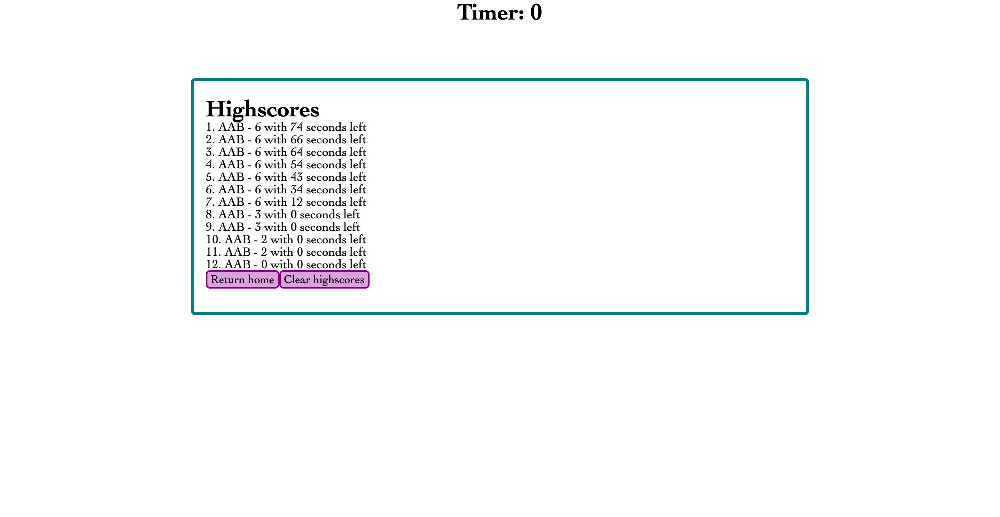

# 04 JavaScript: Code Quiz

https://anguswaffle.github.io/codeQuiz/

## Functionality
User is prompted to beging code quiz. Questions are randomly drawn from a predetermined pool with answers scrambled. Correct answers allow user to continue, incorrect answers deduct time. Game ends with an empty question pool or when clock hits 0. User is prompted to enter initials which will save alongside score and time remaining. User is presented with a list of locally saved highscores ranked by score and then time remaining. "Clear highscore" button clears local storage. Highscores are accessible by clicking "View Highscore" button on splash.

## Mock-Up
The following image shows the web application's appearance and functionality:

